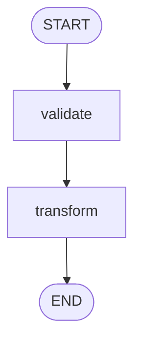

# ai-sdk-graph

A TypeScript library for building stateful, resumable workflows with human-in-the-loop support.

## Features

- **Human in the Loop** — Suspend execution to wait for user input, approvals, or external data, then resume seamlessly
- **Type-safe** — Full TypeScript support with generic state management
- **Resumable** — Checkpoint and resume execution from any point
- **Composable** — Nested subgraphs with state mapping
- **Parallel Execution** — Fork workflows with multiple edges from a single node
- **Conditional Routing** — Dynamic edges based on state
- **Visualization** — Generate Mermaid diagrams of your workflows

## Installation

```bash
npm i ai-sdk-graph
```

## Quick Start

```typescript
import { graph } from 'ai-sdk-graph'

const workflow = graph<{ value: number }>()
  .node('validate', ({ update }) => {
    update({ value: 10 })
  })
  .node('transform', ({ update, state }) => {
    update({ value: state().value * 2 })
  })
  .edge('START', 'validate')
  .edge('validate', 'transform')
  .edge('transform', 'END')

// Execute the workflow
const stream = workflow.execute('run-1', { value: 0 })
```

## Core Concepts

### Nodes

Nodes are execution units that receive a context object with:

- `state()` — Read the current state
- `update(changes)` — Update state with partial object or function
- `suspense(data?)` — Pause execution for human-in-the-loop
- `writer` — Stream writer for UI integration

```typescript
graph<{ count: number }>()
  .node('increment', ({ state, update }) => {
    update({ count: state().count + 1 })
  })
```

### Edges

Connect nodes with static or dynamic routing:

```typescript
// Static edge
.edge('START', 'validate')

// Dynamic edge based on state
.edge('router', (state) => state.isValid ? 'process' : 'reject')
```

### State Management

State is type-safe and immutable. Updates can be partial objects or functions:

```typescript
// Partial update
update({ status: 'complete' })

// Functional update
update((state) => ({ count: state.count + 1 }))
```

### Human in the Loop

Suspend execution to wait for user input, approvals, or external data:

```typescript
const workflow = graph<{ approved: boolean }>()
  .node('review', ({ state, suspense }) => {
    if (!state().approved) {
      suspense({ reason: 'Waiting for approval' })
    }
  })
  .edge('START', 'review')
  .edge('review', 'END')

// First execution suspends
workflow.execute('run-1', { approved: false })

// Resume with updated state after user approves
workflow.execute('run-1', (existing) => ({ ...existing, approved: true }))
```

## Parallel Execution

Multiple edges from the same node execute targets in parallel:

```typescript
graph<{ results: string[] }>()
  .node('fork', () => {})
  .node('taskA', ({ update }) => update({ results: ['A'] }))
  .node('taskB', ({ update }) => update({ results: ['B'] }))
  .node('join', () => {})
  .edge('START', 'fork')
  .edge('fork', 'taskA')  // Both taskA and taskB
  .edge('fork', 'taskB')  // execute in parallel
  .edge('taskA', 'join')
  .edge('taskB', 'join')
  .edge('join', 'END')
```

## Subgraphs

Compose workflows with nested graphs:

```typescript
const childGraph = graph<{ value: number }>()
  .node('double', ({ update, state }) => {
    update({ value: state().value * 2 })
  })
  .edge('START', 'double')
  .edge('double', 'END')

const parentGraph = graph<{ input: number; result: number }>()
  .graph('process', childGraph, {
    input: (parentState) => ({ value: parentState.input }),
    output: (childState) => ({ result: childState.value })
  })
  .edge('START', 'process')
  .edge('process', 'END')
```

## Storage

By default, graphs use in-memory storage. For production, use Redis:

```typescript
import { graph } from 'ai-sdk-graph'
import { RedisStorage } from 'ai-sdk-graph/storage'
import Redis from 'ioredis'

const redis = new Redis()
const storage = new RedisStorage(redis)

const workflow = graph<State>(storage)
  // ... define nodes and edges
```

## Visualization

Generate Mermaid diagrams of your workflows:

```typescript
const diagram = workflow.toMermaid()
// or with direction
const diagram = workflow.toMermaid({ direction: 'LR' })
```

Output:


## API Reference

### `graph<State>(storage?)`

Create a new graph with optional storage backend.

### `.node(id, handler)`

Add a node with an execution handler.

### `.edge(from, to)`

Add a static edge between nodes.

### `.edge(from, (state) => nodeId)`

Add a dynamic edge that routes based on state.

### `.graph(id, subgraph, options)`

Add a nested subgraph with state mapping.

### `.execute(runId, initialState)`

Execute the graph and return a readable stream.

### `.toMermaid(options?)`

Generate a Mermaid flowchart diagram.

## License

MIT
